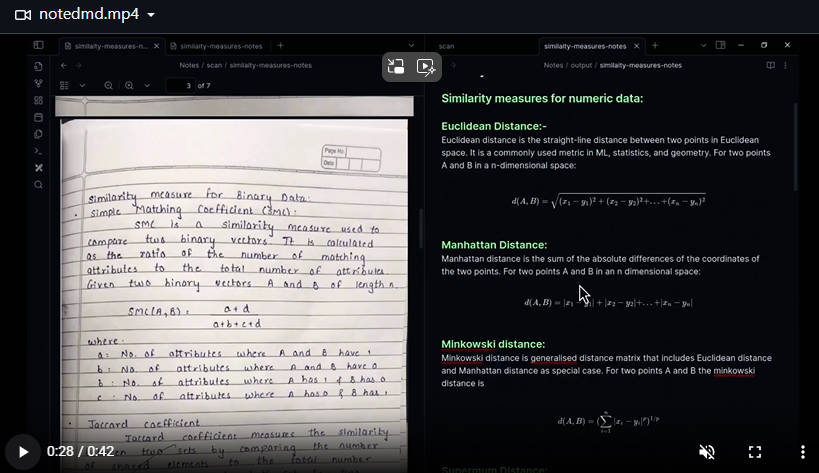

日报20250707

## 另一种收购
现在，如果一家公司想收购OpenAI，是否可能？目前OpenAI估值1570亿美元，背后还有微软这样的巨头，收购几乎不可能。

但是，跟传统企业相比，OpenAI的价值，主要在于人。这使得收购可以以另一种方式进行：挖角。

1亿美金，3亿美金，在小小的花园里面挖啊挖啊挖。。。

## 量化巨头Jane Street在印度市场割韭菜，被印度监管重锤
7.4日，印度监管机构禁止美国量化巨头Jane Street进入当地市场，同时没收其5.67亿美元资金，印度监管机构称该公司通过衍生品头寸操纵股票指数。

是印度赚钱印度花，一分别想拿回家？

还是印度版的ysd？

前天朋友说这个，我还以为是1，我还说莫顿老仙这么牛，美国爸爸的钱都敢扣，这基金公司的老板玩这么大，怎么不结识下川皇当保护伞？

原来是2，呵呵。

## 德州洪灾的帽子扣到川皇头上了
美国德州洪灾78人死亡，其中28人为儿童。女子夏令营Camp Mystic是重灾区。有部分专家说，特朗普政府对气象部门的裁员，是否导致未能准确预测洪灾的严重程度？

这就是改革的难度。

大家都知道官僚机构人员冗余，效率低下，你不裁他，他也预测不了。但是你一裁，他就说预测不准就是因为你裁了人。

## 澳大利亚提议强制要求主人每天至少陪伴宠物狗三个小时
澳大利亚首都领地的《犬只行为准则》草案提议强制要求主人每天至少陪伴宠物狗三个小时。

这就是动物保护主义不得人心的原因。有没有时间陪孩子3个小时？还强制陪狗3个小时，陪你妹！

## 上班的目的
@Morris_LT:上班的目的是尽快赚钱，从青楼赎身，而你TMD却想当头牌。

@SingleCodeDog: 当了头牌才能尽快赚钱啊。

没毛病，你们两个说的都超有道理。

## 一个AI小玩具：noted.md
github上有个开源小工具：[tejas-raskar/noted.md: A command-line tool to convert handwritten notes to markdown files](https://github.com/tejas-raskar/noted.md)，可以在命令行中调用AI工具识别手写笔记，直接转化为md文档，对数学公式的支持也很好，适合科研使用。

