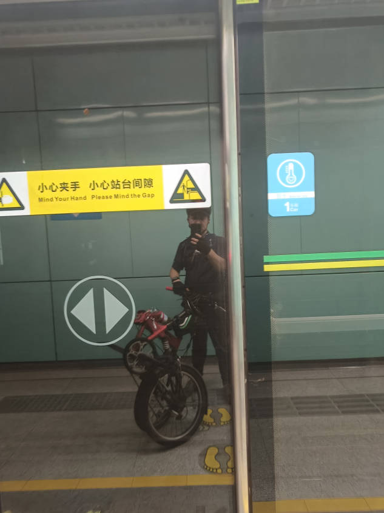
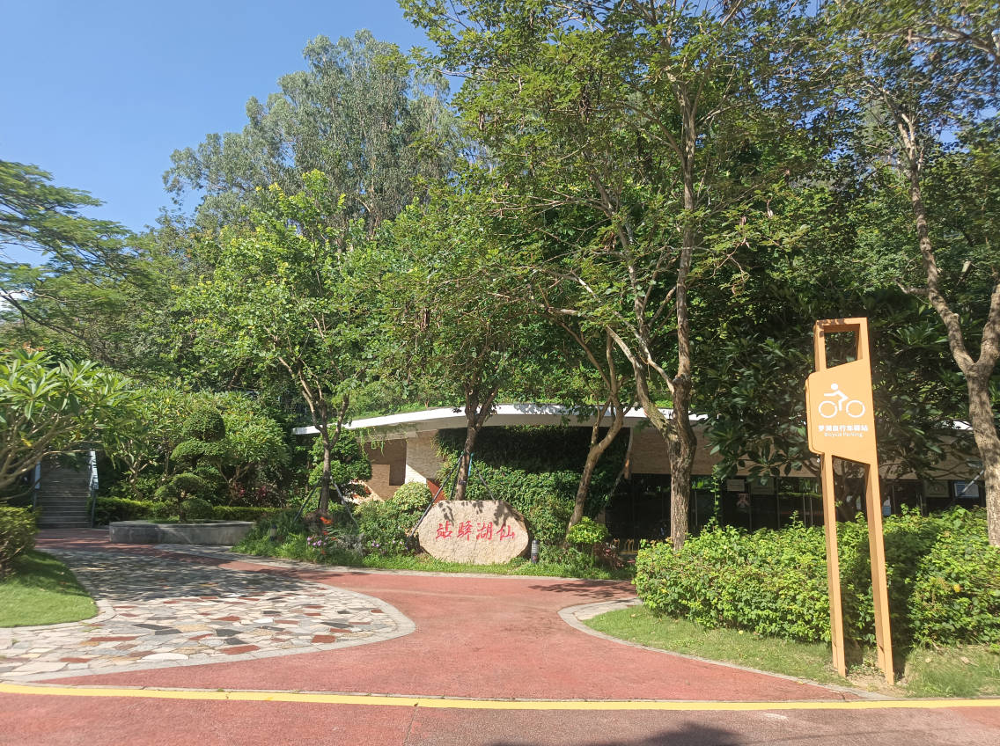
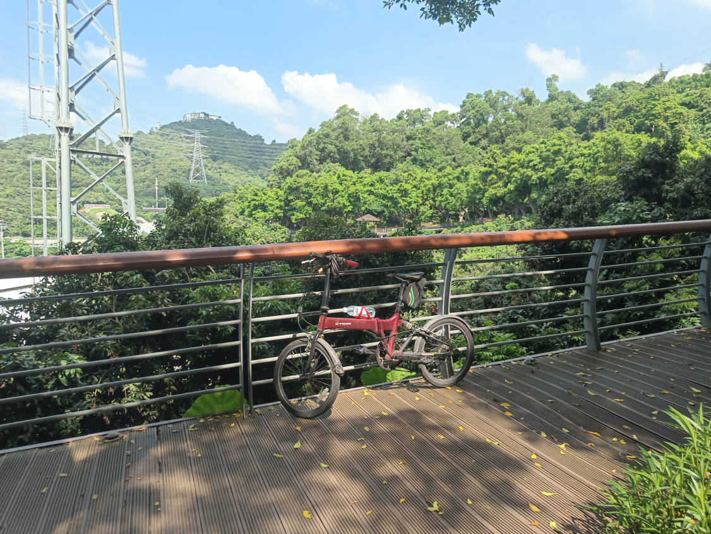
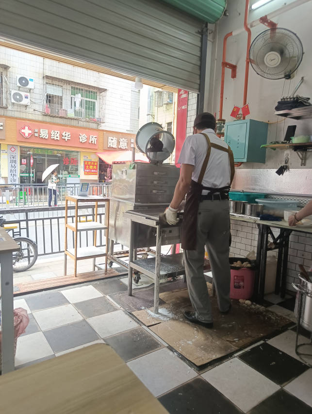

日报20250706

## 马斯克宣布成立美国党
一个南非出身和长大的人，一个入籍手续有瑕疵的人，现在为了把自由还给美国人，宣布要成立“美国党”。厂公真优秀。

大统领说，给媒体爆料老马嗑药的人，你们猜是谁？对了，正式区区在下。

既讨厌民主党，又讨厌特朗普的人，你们以后投票有了新选择了。

## 今日骑行
昨天大佬们组织了深圳水库的骑行，我因故没有参加，今天补下课。

公路我是不太敢，也不太想骑了，今天就带上折叠坐地铁到罗湖休闲体育公园，开始环深圳水库骑行。

早上天气很舒适，环水库都有树荫，也没有什么陡坡，轻轻松松来到了网红桥，过了网红桥，就到了淘金山。

累了就歇歇脚发个圈，一堆人提醒我热，我想这一点都不热啊。

到了10点左右就有点饿了，穿过供水隧道去村子里吃早饭。这个老板有意思，跟路过的每个人打招呼，仿佛都是他的熟人。于是就在他家吃个肠粉吧。老板说肠粉没有了，只有蒸米粉。第一次碰到早餐店没有肠粉了。老板解释说这是他的副业，他主业是教练（小汽车）。中午就把店租给卖凉菜的，他去上课了。

吃完就准备骑到最近的地铁站回家了。结果无遮挡的两个大坡，我终于明白大家为甚么说热了，确实很热。

今日骑行，3很舒服，3热，有点累，总体8分。

快到站的时候，想喝杯柠檬水，美团团购才6块钱。有意思的是，半天成不了团，我退款准备直接买，兴哥又说不拼也能成团，兴哥你手下真优秀，活该你挣钱。

火热的夏天，骑完车一杯柠檬水，这就是生活。
